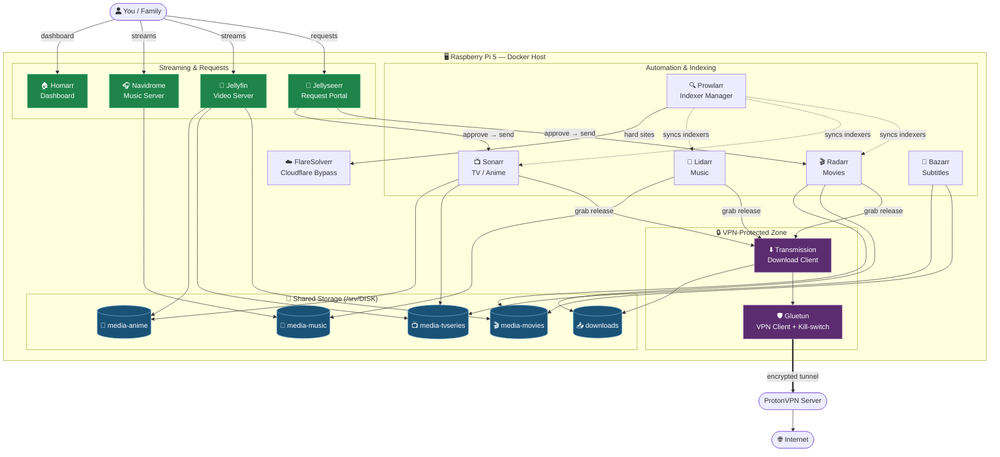

# Building a Privacy-Focused Self-Hosted Media Stack on Raspberry Pi 5

A complete guide to running your own automated media server — movies, TV, anime, music, and subtitles — all behind a VPN, on a single Raspberry Pi 5.

## What is a "Media Stack"?

A media stack is a collection of self-hosted, containerized applications that work together to **find, download, organize, and stream** your media library. Instead of one monolithic app, each tool does one job well and talks to the others through APIs.

This setup is built around three pillars:

1. **Privacy** — All download traffic is routed through a VPN (Gluetun + ProtonVPN), hiding it from your ISP.
2. **Automation** — The "Servarr" suite (Radarr, Sonarr, Lidarr, etc.) handles searching, downloading, renaming, and organizing automatically.
3. **Streaming** — Jellyfin and Navidrome serve your media to any device, anywhere.

## The Components

| Category | Service | Purpose |
|---|---|---|
| **VPN** | **Gluetun** | VPN client container. Routes download traffic through ProtonVPN with a built-in kill-switch. |
| **Anti-bot** | **FlareSolverr** | Solves Cloudflare challenges so indexers stay reachable. |
| **Download** | **Transmission** | BitTorrent client that fetches the actual files. |
| **Indexers** | **Prowlarr** | Central manager for all your torrent/Usenet indexers. Feeds the *arr apps. |
| **Movies** | **Radarr** | Monitors, searches, and organizes movies. |
| **TV / Anime** | **Sonarr** | Monitors, searches, and organizes TV series and anime. |
| **Music** | **Lidarr** | Monitors, searches, and organizes music. |
| **Subtitles** | **Bazarr** | Automatically downloads subtitles for Radarr/Sonarr content. |
| **Dashboard** | **Homarr** | A single home page with links and status for every service. |
| **Media Server** | **Jellyfin** | Streams movies, TV, and anime (with hardware transcoding). |
| **Music Server** | **Navidrome** | Streams your music library (Subsonic-compatible). |
| **Requests** | **Jellyseerr** | A friendly "request a movie/show" portal that auto-sends approvals to Radarr/Sonarr. |

## Architecture

Here's how everything fits together. Notice that **only Transmission's traffic flows through the VPN** — the management apps and streaming servers stay on the local network for speed and direct access.



### The end-to-end flow

1. A user opens **Jellyseerr** and requests a movie.
2. Once approved, Jellyseerr passes the request to **Radarr** (or **Sonarr** for shows).
3. Radarr asks **Prowlarr** which indexers to search; FlareSolverr helps with Cloudflare-protected sites.
4. Radarr sends the best release to **Transmission**.
5. Transmission downloads it **through Gluetun's VPN tunnel** — your ISP only sees encrypted traffic.
6. When the download finishes, Radarr **renames and moves** the file into `media-movies`.
7. **Bazarr** spots the new file and fetches subtitles.
8. **Jellyfin** sees the new content and makes it instantly streamable to any device.

## Prerequisites

- **Raspberry Pi 5** (4 GB or 8 GB recommended) running a 64-bit OS (Raspberry Pi OS Lite or Ubuntu Server).
- **Docker** and **Docker Compose** installed.
- An **external drive** for storage (formatted, e.g., ext4) mounted under `/srv`.
- A **VPN subscription** with port-forwarding support (ProtonVPN, PIA, Mullvad, etc.).

## Setup Steps

### 1. Install Docker and Docker Compose

```bash
# Install Docker
curl -fsSL https://get.docker.com | sh

# Add your user to the docker group (avoids sudo)
sudo usermod -aG docker $USER
newgrp docker

# Verify
docker --version
docker compose version
```

### 2. Find your disk UUID

Every volume path uses your disk's UUID so mounts survive reboots. Find it with:

```bash
lsblk -f
# or
sudo blkid
```

Copy the `UUID` of your data drive — you'll replace `<DISK_UUID>` with it everywhere in the compose file.

### 3. Create users and folder structure

It's good practice to run each service under its own non-root user (the `PUID`/`PGID` values). Create a shared group and the directory layout:

```bash
# Create a shared group (PGID 1001 in the compose file)
sudo groupadd -g 1001 mediastack

# Media library folders (replace <DISK_UUID>)
sudo mkdir -p /srv/<DISK_UUID>/{downloads,media-movies,media-tvseries,media-anime,media-music}

# Config folders
sudo mkdir -p /var/lib/{gluetun,transmission,prowlarr,radarr,sonarr,lidarr,jellyfin,navidrome,jellyseerr}
sudo mkdir -p /var/lib/bazarr/config /var/lib/homarr_v2/appdata

# Set ownership (adjust as needed)
sudo chown -R 1000:1001 /srv/<DISK_UUID>
```

> 💡 **Tip:** Using a single shared group (`PGID=1001`) lets every app read and write the same `downloads` folder, which is essential for the *arr apps to hardlink/move completed files.

### 4. Enable the TUN device (for the VPN)

Gluetun needs `/dev/net/tun`:

```bash
sudo modprobe tun
echo "tun" | sudo tee -a /etc/modules
```

### 5. Generate required secrets

```bash
# Homarr encryption key
openssl rand -hex 32
```

Save this for the `SECRET_ENCRYPTION_KEY` value.

### 6. Get your VPN credentials

For ProtonVPN with OpenVPN, you need the **OpenVPN/IKEv2 username and password** (not your login email/password) — find them in your ProtonVPN account dashboard under *Account → OpenVPN / IKEv2 username*.

### 7. Create the `docker-compose.yml`

Save the generic compose file (below) and fill in every `<PLACEHOLDER>`.

### 8. Launch the stack

```bash
# Start everything in the background
docker compose up -d

# Watch the logs (especially Gluetun — confirm the VPN connects)
docker compose logs -f gluetun
```

You should see Gluetun report a successful connection and a forwarded port.

### 9. Verify the VPN is working

Confirm Transmission's traffic exits via the VPN, not your home IP:

```bash
docker exec transmission curl -s https://ipinfo.io/ip
```

The IP returned should be your **VPN server's IP**, not your real one. If it matches your home IP, stop and fix the networking before downloading anything.

### 10. Configure the apps (in this order)

1. **Prowlarr** (`:9696`) — Add your indexers and the FlareSolverr proxy (`http://flaresolverr:8191`).
2. **Transmission** (`:9091`) — Set your download category folders.
3. **Radarr / Sonarr / Lidarr** — Connect to Prowlarr (it auto-pushes indexers), add Transmission as the download client, and set root folders (`/movies`, `/tv`, `/anime`, `/music`).
4. **Bazarr** (`:6767`) — Connect to Radarr and Sonarr; choose subtitle languages.
5. **Jellyfin** (`:8096`) — Add libraries pointing to `/data/movies`, `/data/tvseries`, `/data/anime`.
6. **Navidrome** (`:4533`) — Point at `/music`.
7. **Jellyseerr** (`:5055`) — Connect to Jellyfin, Radarr, and Sonarr.
8. **Homarr** (`:7575`) — Add tiles for all the above.

## The Generic `docker-compose.yml`

I've genericized the original file: removed hard-coded secrets, replaced ProtonVPN-specific values with provider-neutral placeholders, replaced `<Disk UUID>` / `<Server IP>` with clearly named tokens, and rewrote every comment to explain **what to change and why**.

```yaml 
# ==============================================================================
#  SELF-HOSTED MEDIA STACK  —  Raspberry Pi 5 (or any Docker host)
# ==============================================================================
#  BEFORE YOU START, replace every <PLACEHOLDER> token below:
#
#    <DISK_UUID>          -> Your data drive's UUID. Find it with: lsblk -f
#                           (used as /srv/<DISK_UUID>/... for all media paths)
#    <VPN_PROVIDER>       -> Your VPN provider name, e.g. protonvpn, pia, mullvad
#                           Full list: https://github.com/qdm12/gluetun/wiki
#    <VPN_USERNAME>       -> VPN service OpenVPN username (NOT your login email)
#    <VPN_PASSWORD>       -> VPN service OpenVPN password
#    <VPN_COUNTRY>        -> Preferred server country, e.g. Netherlands
#    <TIMEZONE>           -> Your TZ, e.g. Asia/Kolkata, Europe/London, UTC
#    <SERVER_IP>          -> The LAN IP of this host, e.g. 192.168.1.50
#    <HOMARR_SECRET_KEY>  -> Generate with: openssl rand -hex 32
#    <WEBUI_USER>         -> A username for the Transmission web UI
#    <WEBUI_PASSWORD>     -> A strong password for the Transmission web UI
#
#  PUID / PGID: each service runs as a dedicated user. Adjust the PUID values
#  to match users on your host, and keep PGID as your shared media group
#  (here: 1001) so every app can read/write the same downloads folder.
# ==============================================================================

services:

  # ----------------------------------------------------------------------------
  #  GLUETUN — VPN client. All download traffic is routed through this container.
  #  Acts as a kill-switch: if the VPN drops, traffic is blocked.
  # ----------------------------------------------------------------------------
  gluetun:
    image: qmcgaw/gluetun:latest
    container_name: gluetun
    cap_add:
      - NET_ADMIN                       # Required to manage the VPN interface
    devices:
      - /dev/net/tun:/dev/net/tun       # Required for the tunnel device
    # NOTE: Because the download client uses "network_mode: service:gluetun",
    #       its ports MUST be published HERE on gluetun, not on the client.
    #       Uncomment the line(s) matching your active download client.
    # ports:
    #   - "9091:9091"                   # Transmission Web UI
    #   - "51413:51413"                 # Transmission peer port (TCP)
    #   - "51413:51413/udp"             # Transmission peer port (UDP)
    #   - "8090:8090"                   # qBittorrent Web UI (if using qBittorrent)
    #   - "6881:6881"                   # qBittorrent peer port (TCP)
    #   - "6881:6881/udp"               # qBittorrent peer port (UDP)
    environment:
      # --- VPN connection ---
      - VPN_SERVICE_PROVIDER=<VPN_PROVIDER>
      - VPN_TYPE=openvpn                # Use "wireguard" if your provider supports it
      - OPENVPN_USER=<VPN_USERNAME>
      - OPENVPN_PASSWORD=<VPN_PASSWORD>
      - SERVER_COUNTRIES=<VPN_COUNTRY>
      # - FREE_ONLY=on                  # ProtonVPN only: restrict to free servers
      - TZ=<TIMEZONE>
      # --- Port forwarding (required for good torrent connectivity) ---
      # Set this to the forwarded/peer port your client listens on.
      - FIREWALL_VPN_INPUT_PORTS=6881
      - HEALTH_VPN_DURATION_INITIAL=30s # Grace period before health checks start
      # --- DNS / privacy hardening ---
      - DOT=off                         # DNS-over-TLS: turn "on" for extra privacy
      - DOT_PROVIDERS=cloudflare
      - BLOCK_MALICIOUS=on
      - BLOCK_SURVEILLANCE=on
    volumes:
      - /var/lib/gluetun:/gluetun       # Stores VPN state/config
    restart: unless-stopped
    networks:
      - mediastack

  # ----------------------------------------------------------------------------
  #  FLARESOLVERR — Solves Cloudflare challenges so indexers stay reachable.
  #  Add it to Prowlarr as a proxy: http://flaresolverr:8191
  # ----------------------------------------------------------------------------
  flaresolverr:
    image: ghcr.io/flaresolverr/flaresolverr:latest
    container_name: flaresolverr
    ports:
      - "8191:8191"
    environment:
      - LOG_LEVEL=info
      - TZ=<TIMEZONE>
    restart: unless-stopped
    networks:
      - mediastack

  # ----------------------------------------------------------------------------
  #  TRANSMISSION — BitTorrent download client.
  #
  #  IMPORTANT — choose ONE networking mode:
  #   (A) Route through the VPN (recommended): UNCOMMENT the network_mode and
  #       depends_on lines below, and REMOVE this service's own "ports:" block
  #       (publish those ports on gluetun instead — see the gluetun section).
  #   (B) Direct connection (NOT private): keep the "ports:" block as-is.
  #  The file ships as (B) so it runs out of the box; switch to (A) for privacy.
  # ----------------------------------------------------------------------------
  transmission:
    image: lscr.io/linuxserver/transmission:latest
    container_name: transmission
    # network_mode: "service:gluetun"   # (A) Route ALL traffic through the VPN
    # depends_on:
    #   gluetun:
    #     condition: service_healthy
    environment:
      - PUID=2011
      - PGID=1001
      - TZ=<TIMEZONE>
      - USER=<WEBUI_USER>               # Web UI username
      - PASS=<WEBUI_PASSWORD>           # Web UI password
    ports:                              # (B) Remove this block if using mode (A)
      - "9091:9091"                     # Transmission Web UI
      - "51413:51413"                   # Peer port (TCP)
      - "51413:51413/udp"               # Peer port (UDP)
    volumes:
      - /var/lib/transmission:/config
      - /srv/<DISK_UUID>/downloads:/downloads
    restart: unless-stopped

  # ----------------------------------------------------------------------------
  #  (OPTIONAL) qBittorrent — alternative download client.
  #  Uncomment this block (and comment out Transmission) if you prefer qBittorrent.
  #  It is pre-wired to route through the VPN via network_mode: service:gluetun.
  # ----------------------------------------------------------------------------
  # qbittorrent:
  #   image: lscr.io/linuxserver/qbittorrent:latest
  #   container_name: qbittorrent
  #   network_mode: "service:gluetun"   # ALL traffic through the VPN
  #   environment:
  #     - PUID=2011
  #     - PGID=1001
  #     - TZ=<TIMEZONE>
  #     - WEBUI_PORT=8090               # Must match the port published on gluetun
  #   volumes:
  #     - /var/lib/qbittorrent:/config
  #     - /srv/<DISK_UUID>/downloads:/downloads
  #   depends_on:
  #     gluetun:
  #       condition: service_healthy
  #   restart: unless-stopped

  # ----------------------------------------------------------------------------
  #  PROWLARR — Indexer manager. Syncs your indexers to Radarr/Sonarr/Lidarr.
  # ----------------------------------------------------------------------------
  prowlarr:
    image: lscr.io/linuxserver/prowlarr:latest
    container_name: prowlarr
    ports:
      - "9696:9696"
    environment:
      - PUID=2012
      - PGID=1001
      - TZ=<TIMEZONE>
    dns:                                # Optional: force a specific DNS resolver
      - 1.1.1.1                         # Cloudflare DNS
      - 1.0.0.1                         # Cloudflare DNS (backup)
    volumes:
      - /var/lib/prowlarr:/config
    restart: unless-stopped
    networks:
      - mediastack

  # ----------------------------------------------------------------------------
  #  RADARR — Movie collection manager.
  # ----------------------------------------------------------------------------
  radarr:
    image: lscr.io/linuxserver/radarr:latest
    container_name: radarr
    ports:
      - "7878:7878"
    environment:
      - PUID=2008
      - PGID=1001
      - TZ=<TIMEZONE>
    volumes:
      - /var/lib/radarr:/config
      - /srv/<DISK_UUID>/media-movies:/movies       # Root folder for movies
      - /srv/<DISK_UUID>/downloads:/downloads       # Must match the client's path
    restart: unless-stopped
    networks:
      - mediastack

  # ----------------------------------------------------------------------------
  #  SONARR — TV series & anime collection manager.
  # ----------------------------------------------------------------------------
  sonarr:
    image: lscr.io/linuxserver/sonarr:latest
    container_name: sonarr
    ports:
      - "8989:8989"
    environment:
      - PUID=2009
      - PGID=1001
      - TZ=<TIMEZONE>
    volumes:
      - /var/lib/sonarr:/config
      - /srv/<DISK_UUID>/media-tvseries:/tv         # Root folder for TV
      - /srv/<DISK_UUID>/media-anime:/anime         # Root folder for anime
      - /srv/<DISK_UUID>/downloads:/downloads
    restart: unless-stopped
    networks:
      - mediastack

  # ----------------------------------------------------------------------------
  #  LIDARR — Music collection manager.
  # ----------------------------------------------------------------------------
  lidarr:
    image: lscr.io/linuxserver/lidarr:latest
    container_name: lidarr
    ports:
      - "8686:8686"
    environment:
      - PUID=2010
      - PGID=1001
      - TZ=<TIMEZONE>
    volumes:
      - /var/lib/lidarr:/config
      - /srv/<DISK_UUID>/media-music:/music         # Root folder for music
      - /srv/<DISK_UUID>/downloads:/downloads
    restart: unless-stopped
    networks:
      - mediastack

  # ----------------------------------------------------------------------------
  #  BAZARR — Subtitle downloader for Radarr & Sonarr libraries.
  #  Point its movie/TV paths at the SAME folders Radarr/Sonarr use.
  # ----------------------------------------------------------------------------
  bazarr:
    image: lscr.io/linuxserver/bazarr:latest
    container_name: bazarr
    environment:
      - PUID=2017
      - PGID=1001
      - TZ=<TIMEZONE>
    volumes:
      - /var/lib/bazarr/config:/config
      - /srv/<DISK_UUID>/media-movies:/movies       # Match Radarr's movie path
      - /srv/<DISK_UUID>/media-tvseries:/tv         # Match Sonarr's TV path
    ports:
      - "6767:6767"
    restart: unless-stopped
    networks:
      - mediastack

  # ----------------------------------------------------------------------------
  #  HOMARR — Customizable dashboard / home page for the whole stack.
  # ----------------------------------------------------------------------------
  homarr:
    image: ghcr.io/homarr-labs/homarr:latest
    container_name: homarr
    restart: unless-stopped
    volumes:
      # Optional: enables Docker integration (show/control containers).
      # Remove this line if you don't want Homarr to access the Docker socket.
      - /var/run/docker.sock:/var/run/docker.sock
      - /var/lib/homarr_v2/appdata:/appdata
    environment:
      - SECRET_ENCRYPTION_KEY=<HOMARR_SECRET_KEY>   # openssl rand -hex 32
      - TZ=<TIMEZONE>
    ports:
      - "7575:7575"
    networks:
      - mediastack

  # ----------------------------------------------------------------------------
  #  JELLYFIN — Video streaming server (movies, TV, anime).
  #  The /dev/dri device enables hardware-accelerated transcoding.
  # ----------------------------------------------------------------------------
  jellyfin:
    image: lscr.io/linuxserver/jellyfin:latest
    container_name: jellyfin
    ports:
      - "8096:8096"                     # HTTP web UI
      - "8920:8920"                     # HTTPS (optional)
      - "7359:7359/udp"                 # Client auto-discovery (optional)
      - "1900:1900/udp"                 # DLNA (optional)
    environment:
      - PUID=2004
      - PGID=1001
      - TZ=<TIMEZONE>
    volumes:
      - /var/lib/jellyfin:/config
      - /srv/<DISK_UUID>/media-movies:/data/movies
      - /srv/<DISK_UUID>/media-tvseries:/data/tvseries
      - /srv/<DISK_UUID>/media-anime:/data/anime
    devices:
      - /dev/dri:/dev/dri               # Remove if your host has no /dev/dri (iGPU)
    restart: unless-stopped
    networks:
      - mediastack

  # ----------------------------------------------------------------------------
  #  NAVIDROME — Music streaming server (Subsonic-compatible).
  # ----------------------------------------------------------------------------
  navidrome:
    image: deluan/navidrome:latest
    container_name: navidrome
    ports:
      - "4533:4533"
    environment:
      - ND_LOGLEVEL=info
      - ND_SESSIONTIMEOUT=24h
      - ND_BASEURL=<SERVER_IP>          # This host's LAN IP or public URL
      - ND_SCANSCHEDULE=1h              # How often to rescan the library
      - ND_TRANSCODINGCACHESIZE=100MB
      - ND_ENABLETRANSCODINGCONFIG=true
      - TZ=<TIMEZONE>
    volumes:
      - /var/lib/navidrome:/data
      - /srv/<DISK_UUID>/media-music:/music
    restart: unless-stopped
    networks:
      - mediastack

  # ----------------------------------------------------------------------------
  #  JELLYSEERR — Media request portal. Users request titles; approvals are
  #  forwarded to Radarr/Sonarr automatically.
  # ----------------------------------------------------------------------------
  jellyseerr:
    image: fallenbagel/jellyseerr:latest
    container_name: jellyseerr
    ports:
      - "5055:5055"
    environment:
      - LOG_LEVEL=info
      - TZ=<TIMEZONE>
      - PUID=2014
      - PGID=1001
    volumes:
      - /var/lib/jellyseerr:/app/config
    restart: unless-stopped
    networks:
      - mediastack
    depends_on:
      - jellyfin
      - radarr
      - sonarr

# ------------------------------------------------------------------------------
#  NETWORKS — A single user-defined bridge lets containers reach each other
#  by name (e.g. http://prowlarr:9696). Do not rename without updating links.
# ------------------------------------------------------------------------------
networks:
  mediastack:
    driver: bridge
```

## Security & Best-Practice Notes

- **Always verify the VPN before downloading** (Step 9). The single most common mistake is leaving Transmission on the host network — that exposes your real IP.
- **Use the kill-switch.** Gluetun blocks all traffic if the tunnel drops; keep `network_mode: service:gluetun` on your download client.
- **Never expose admin UIs to the internet directly.** If you want remote access, put a reverse proxy (e.g., Caddy/Traefik) with HTTPS and authentication in front, or use a VPN like Tailscale/WireGuard.
- **Pin image versions** (`:latest` → a specific tag) once everything works, so an upstream update can't break your stack unexpectedly.
- **Back up your `/var/lib/*` config folders** — they hold all your settings, API keys, and history.
- **Respect copyright laws** in your jurisdiction; use this stack only for content you're legally entitled to.
